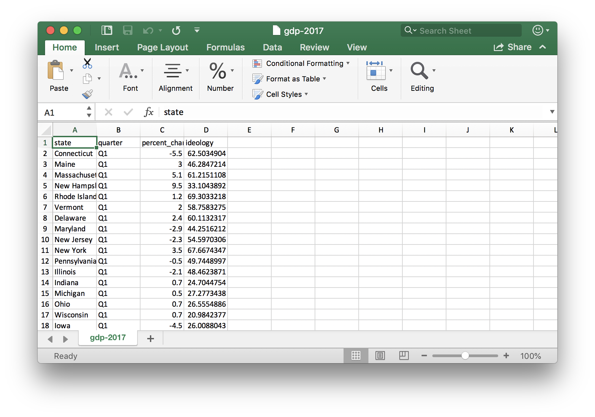
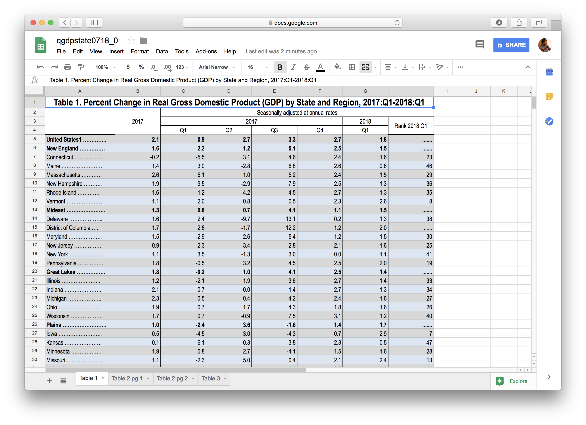
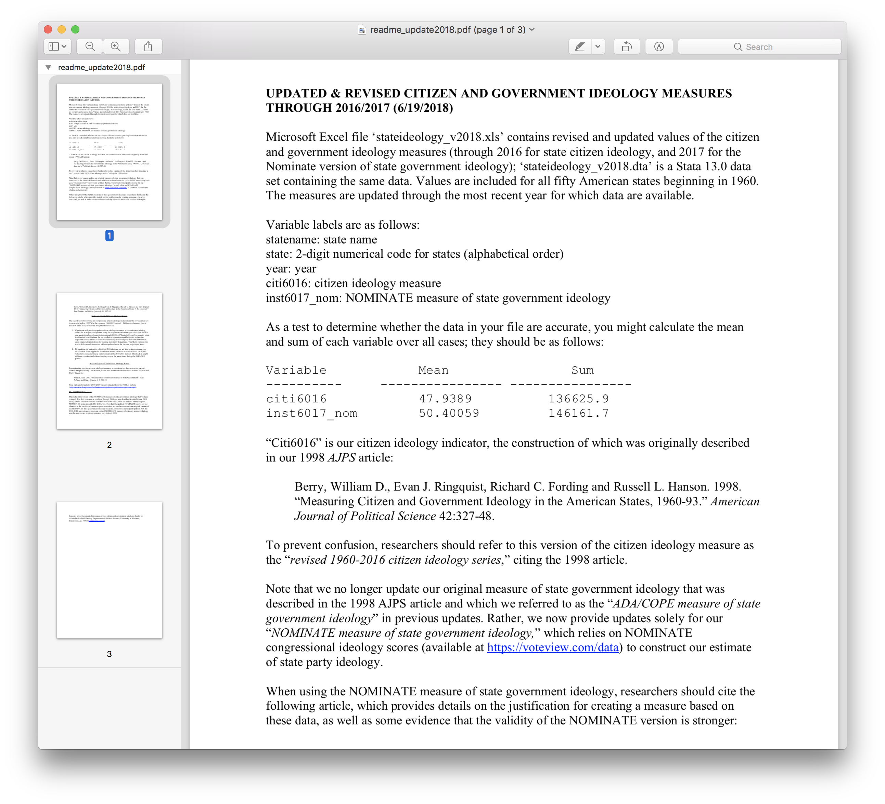

```{r setup, include=FALSE}
options(htmltools.dir.version = FALSE)
```

```{r, setup2, include=FALSE}
knitr::opts_knit$set(root.dir = '../09-slides-wrangling/')
```

class: middle, center

# to **wrangle** is to **act**

---

class: middle, center

# wrangling is **hard**

there are 1000s of tasks; you must learn each task

it's not general like `ggplot()`

---

# to **wrangle** is to...

`read_***()`, 
`glimpse()`, 
`filter()`, 
`select()`, 
`rename()`, 
`mutate()`, 
`pivot_longer()`,
`join()`, and 
`write_***()`


---
class: bottom, center

# what we want 
--

### 50 states

--

### four quarters

--

### percent change in GDP

--

### state political ideology

---
class: middle, center

# what we want 

### 50 states

### four quarters

### percent change in GDP

### state political ideology

---
class: middle, center



---

# data on GDP in the U.S. states

--
* On Sept. 11, 2018, I went to the BEA's website and grabbed their [current release](https://www.bea.gov/data/gdp/gdp-state) of GDP by state. 

--
* To preserve the raw data file, I changed nothing and uploaded [`qgdpstate0718_0.xlsx`](https://docs.google.com/spreadsheets/d/1y10LLeyfMir4e2uz87frYb2PVXtS41hXXBqMz828GFQ/edit#gid=556942308) to Google Drive as a Google Sheet.

--
* To use the data locally, I downloaded `qgdpstate0718_0.xlsx` using *File* > *Download as...* > *Comma-separated values (.csv, current sheet)*. I added it to the `data/` subdirectory.

---
class: middle, center




---

background-image: url("https://upload.wikimedia.org/wikipedia/commons/1/11/Noto_Emoji_Oreo_1f92c.svg")
background-size: cover

---

background-image: url("https://upload.wikimedia.org/wikipedia/commons/6/63/Twemoji2_1f914.svg")
background-size: cover

---
class: middle, center

# reading the data into R

### `read_csv()`

---

```{r}
# load packages
library(tidyverse)
```

---

```{r}
# read data
gdp_df_raw <- read_csv("data/qgdpstate0718_0 - Table 1.csv")
```

---
class: middle, center


---

```{r}
# read data, again
gdp_df_raw <- read_csv("data/qgdpstate0718_0 - Table 1.csv", 
                       skip = 3)
```

---

```{r}
# quick look
glimpse(gdp_df_raw)
```

---
class: center, middle
# filtering rows

### `filter()`

---

```{r}
# filter the rows we want
gdp_df <- filter(gdp_df_raw, ...8 != ".......")

# quick look
glimpse(gdp_df)
```

---
class: center, middle

# selecting columns

### `select()`

---
```{r}
# select the rows we want
gdp2_df <- select(gdp_df, -...2, -Q1...7, -...8)

# quick look
glimpse(gdp2_df)
```

---
class: center, middle

# renaming columns

### `rename()`

---
```{r}
# rename the pooly named variables
gdp3_df <- rename(gdp2_df, state = ...1, 
                  Q1 = Q1...3)

# quick look
glimpse(gdp3_df)
```

---
class: middle, center


---
class: middle, center

# three **actions** so far

### `filter()`
### `select()`
### `rename()`

---

# All Together Now!

```{r message=FALSE, warning=FALSE}
# read data
gdp_df_raw <- read_csv("data/qgdpstate0718_0 - Table 1.csv", 
                       skip = 3)

# clean data
gdp_df <- filter(gdp_df_raw, ...8 != ".......")
gdp2_df <- select(gdp_df, -...2, -Q1...7, -...8)
gdp3_df <- rename(gdp2_df, state = ...1, 
                  Q1 = Q1...3)


# quick look
glimpse(gdp3_df)
```

---
class: middle, center

# This whole `gdp_df`, `gdp2_df`, `gdp3_df`, ... isn't very satisfying.

---
class:middle

# Notice that the data frame output from one function is the input to the next...

```
# read data
gdp_df_raw <- read_csv("data/qgdpstate0718_0 - Table 1.csv", 
                       skip = 3)

# clean data
gdp_df <- filter(gdp_df_raw, ...8 != ".......")
gdp2_df <- select(gdp_df, -...2, -Q1...7, -...8)
gdp3_df <- rename(gdp2_df, state = ...1, 
                  Q1 = Q1...3)
```

---
class: middle, center

# enter the pipe


---

# All Together Now! With a Pipe...  😎

```{r message=FALSE, warning=FALSE}
# read data
gdp_df_raw <- read_csv("data/qgdpstate0718_0 - Table 1.csv", 
                       skip = 3)

# clean data
gdp_df <- filter(gdp_df_raw, ...8 != ".......") %>%
  select(-...2, -Q1...7, -...8) %>%
  rename(state = ...1, Q1 = Q1...3)
```

---
class: middle, center

# mutating variables

### `mutate()`

---

```{r message=FALSE, warning=FALSE}
# clean data
gdp_df <- filter(gdp_df_raw, ...8 != ".......") %>%
  select(-...2, -Q1...7, -...8) %>%
  rename(state = ...1, Q1 = Q1...3) %>% 
  # mutate state (remove all non-alpha characters)
  mutate(state = str_remove_all(state, pattern = "\\W")) %>%
  glimpse()
```
---
```{r message=FALSE, warning=FALSE}
# clean data
gdp_df <- filter(gdp_df_raw, ...8 != ".......") %>%
  select(-...2, -Q1...7, -...8) %>%
  rename(state = ...1, Q1 = Q1...3) %>% 
  mutate(state = str_remove_all(state, pattern = "\\W")) %>%
  # add spaces before upper-case letters preceeded by a lower-case
  mutate(state = str_replace(state, 
                             pattern = "([a-z])([A-Z])", 
                             replacement = "\\1 \\2")) %>%
  glimpse()
```
---
### details

--
```
gdp_df <- filter(gdp_df_raw, ...8 != ".......") %>%
  select(-...2, -Q1...7, -...8) %>%
  rename(state = ...1, Q1 = Q1...3) %>% 
  mutate(state = str_remove_all(state, pattern = "\\W")) %>%
  mutate(state = str_replace(state, 
                             pattern = "([a-z])([A-Z])", 
                             replacement = "\\1 \\2")) %>%
  glimpse()
```

--
* `mutate()` changes a variable in a data frame, but **returns a data frame**.

--
* `str_remove_all()` looks at every character in each element of a character vector and removes the characters that match a pattern. **It outputs a character vector the same length as the input.**

--
* `pattern = "\\W"` is regex for "non-letters."

--
* `str_replace()` looks at every character in each element of a character vector and replaces the characters that match a pattern. **It outputs a character vector the same length as the input.**

--
* `pattern = "([a-z])([A-Z])"` is regex for "lower-case letter followed by upper-case letter."

--
* `replacement = "\\1 \\2""` is regex for "the first match in parenthesis (e.g., w), a space, and the second match in parenthesis (e.g., H)."

---
class: middle, center

# whenver you need to use regex, remember the following...

---

class: middle, center


---

class: middle, center

# gathering columns

### ~~`gather()`~~

### `pivot_longer()`

---
```{r message=FALSE, warning=FALSE}
# clean data
gdp_df <- filter(gdp_df_raw, ...8 != ".......") %>%
  select(-...2, -Q1...7, -...8) %>%
  rename(state = ...1, Q1 = Q1...3) %>% 
  mutate(state = str_remove_all(state, pattern = "\\W")) %>%
  mutate(state = str_replace(state, pattern = "([a-z])([A-Z])", 
                             replacement = "\\1 \\2")) %>%
  # gather columns Q1-Q4 into a single variable
  # gather(quarter, percent_change_in_gdp, Q1:Q4) %>%  # gather(): old approach
  pivot_longer(cols = Q1:Q4,                           # pivot_longer(): new approach
               names_to = "quarter", 
               values_to = "percent_change_in_gdp") %>%
  glimpse()
```
---
class: middle, center

# mutating variables (again)

### `mutate()`

---

```{r message=FALSE, warning=FALSE}
# clean data
gdp_df <- filter(gdp_df_raw, ...8 != ".......") %>%
  select(-...2, -Q1...7, -...8) %>%
  rename(state = ...1, Q1 = Q1...3) %>% 
  mutate(state = str_remove_all(state, pattern = "\\W")) %>%
  mutate(state = str_replace(state, pattern = "([a-z])([A-Z])", 
                             replacement = "\\1 \\2")) %>%
  pivot_longer(cols = Q1:Q4, 
               names_to = "quarter", 
               values_to = "percent_change_in_gdp") %>%  
  # mutate quarter from character into factor
  mutate(quarter = factor(quarter)) %>%  
  glimpse()
```

---
class: center, middle

# joining new columns

### `left_join()`

---

class: center, middle


---

class: center, middle




---

# data on the ideology of U.S. states

--
* On Sept. 12, 2018, I went to the Richard Fording's [website](https://rcfording.wordpress.com/state-ideology-data/) and grabbed the [latest version](https://www.dropbox.com/s/rx3fkoq8q61xqmh/stateideology_v2018.dta?dl=0) of [Berry, Ringquist, Fording, and Hanson's](https://rcfording.files.wordpress.com/2018/06/brfh_2015.pdf) measure of state political ideology. 

--
* To preserve the raw data file, I changed nothing and uploaded [`stateideology_v2018.dta`](https://drive.google.com/file/d/1y4sgRqf8yq5WNKJ3AOCzrpcM6rKTxtCK/view?usp=sharing) to Google Drive as a Google Sheet.

--
* To use the data locally, I downloaded `stateideology_v2018.dta` using the *Download* button. I added it to the `data/` subdirectory.

---

```{r message=FALSE, warning=FALSE}
# load packages
library(haven)

# read data
fording_df_raw <- read_dta("data/stateideology_v2018.dta") %>%
  glimpse
```
---
```{r message=FALSE, warning=FALSE}
# clean data
fording_df <- fording_df_raw %>%
  # filter observations from 2017
  filter(year == 2017) %>%
  glimpse()
```
---
```{r message=FALSE, warning=FALSE}
# clean data
fording_df <- fording_df_raw %>%
  filter(year == 2017) %>%
  # select the two variables we need
  select(statename, inst6017_nom) %>%  
  glimpse()
```
---
```{r message=FALSE, warning=FALSE}
# clean data
fording_df <- fording_df_raw %>%
  filter(year == 2017) %>%
  select(statename, inst6017_nom) %>%
  # rename the variables more sensibly (and to match gdp_df)
  rename(state = statename, ideology = inst6017_nom) %>%
  glimpse()
```

---

```{r}
# clean data
gdp_df <- filter(gdp_df_raw, ...8 != ".......") %>%
  select(-...2, -Q1...7, -...8) %>%
  rename(state = ...1, Q1 = Q1...3) %>% 
  mutate(state = str_remove_all(state, pattern = "\\W")) %>%
  mutate(state = str_replace(state, pattern = "([a-z])([A-Z])", 
                             replacement = "\\1 \\2")) %>%
  pivot_longer(cols = Q1:Q4, 
               names_to = "quarter", 
               values_to = "percent_change_in_gdp") %>%  
  mutate(quarter = factor(quarter)) %>%
  # join fording_df to the left
  left_join(fording_df) %>%
  glimpse()
```

---
class: center, middle

# writing the new data set to a file

### `write_csv()` 

and 

### `write_rds()`

---

```{r message=FALSE, warning=FALSE}
# clean data
gdp_df <- filter(gdp_df_raw, ...8 != ".......") %>%
  select(-...2, -Q1...7, -...8) %>%
  rename(state = ...1, Q1 = Q1...3) %>% 
  mutate(state = str_remove_all(state, pattern = "\\W")) %>%
  mutate(state = str_replace(state, pattern = "([a-z])([A-Z])", 
                             replacement = "\\1 \\2")) %>%
  gather(quarter, percent_change_in_gdp, Q1:Q4) %>%
  mutate(quarter = factor(quarter)) %>%
  left_join(fording_df) %>%
  # write clean data set to file
  write_rds("data/gdp-2017.rds") %>%  # preserve factors
  write_csv("data/gdp-2017.csv") %>%  # browse on github
  glimpse()
```

---

# 🧐quick check

```{r}
summary(gdp_df)
```

# 👍it looks okay
---

```{r fig.height=6, fig.width=9}
# fit model
fit <- lm(percent_change_in_gdp ~ ideology, data = gdp_df)

# print estimates
arm::display(fit, detail = TRUE)
```

---

```{r fig.height=6, fig.width=9}
ggplot(gdp_df, aes(x = ideology, y = percent_change_in_gdp)) + 
  geom_smooth(method = "lm") + 
  geom_point() + 
  facet_wrap(vars(quarter))
```

---

class: middle, center

# pwning factors

---

```{r fig.height=6, fig.width=9}
cg_df <- read_rds("data/parties.rds") %>%
  glimpse()
```

---

```{r fig.height=6, fig.width=9}
ggplot(cg_df, aes(x = enep, y = country)) + 
  geom_point()
```

---

### `reorder()` existing factors

```{r fig.height=6, fig.width=9}
new_cg_df <- cg_df %>%
  mutate(country = reorder(country, average_magnitude))

ggplot(new_cg_df, aes(x = enep, y = country)) + 
  geom_point()
```

---

### `cut_*()` into new factors

| Function         | Action                                                              |
|------------------|---------------------------------------------------------------------|
| `cut_interval()` | makes `n` groups with equal range                                   |
| `cut_number()`   | makes `n` groups with (approximately) equal numbers of observations |
| `cut_width()`    | makes groups of width width                                         |

---

```{r fig.height=6, fig.width=9}
new_cg_df <- cg_df %>%
  mutate(social_heterogeneity_alt = cut_number(eneg, n = 3))

ggplot(new_cg_df, aes(x = enep)) + 
  geom_histogram() + 
  facet_wrap(vars(social_heterogeneity_alt))
```

---

```{r fig.height=6, fig.width=9}
new_cg_df <- cg_df %>%
  mutate(social_heterogeneity_alt = cut_number(eneg, n = 5))

ggplot(new_cg_df, aes(x = enep)) + 
  geom_histogram() + 
  facet_wrap(vars(social_heterogeneity_alt))
```

---

```{r fig.height=6, fig.width=9}
new_cg_df <- cg_df %>%
  mutate(social_heterogeneity_alt = cut_number(eneg, n = 2))

ggplot(new_cg_df, aes(x = enep)) + 
  geom_histogram() + 
  facet_wrap(vars(social_heterogeneity_alt))
```

---

```{r fig.height=6, fig.width=9}
new_cg_df <- cg_df %>%
  mutate(social_heterogeneity_alt = cut_interval(eneg, n = 3))

ggplot(new_cg_df, aes(x = enep)) + 
  geom_histogram() + 
  facet_wrap(vars(social_heterogeneity_alt))
```

---

```{r fig.height=6, fig.width=9}
new_cg_df <- cg_df %>%
  mutate(social_heterogeneity_alt = cut_width(eneg, width = 2))

ggplot(new_cg_df, aes(x = enep)) + 
  geom_histogram() + 
  facet_wrap(vars(social_heterogeneity_alt))
```

---

class: middle, center

### more factor pwnage: forcats package

(see the cheatsheet)

---

### `case_when()` for manual factor creation

```{r}
starwars %>%
  select(name:mass, gender, species) %>%
  mutate(type = case_when(height > 200 | mass > 200 ~ "large",
                          species == "Droid"        ~ "robot",
                          TRUE                      ~ "other")) %>% 
  glimpse()
```

