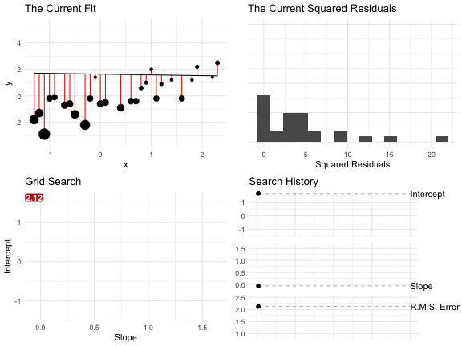

class: center, middle

### a regression model is just an equation for a scatterplot

```{r, include=FALSE}
library(tidyverse)
library(kableExtra)
library(broom)
library(ggrepel)
knitr::opts_chunk$set(echo = TRUE, fig.width=6, fig.height=4, fig.align = "center", dpi = 300,
                      message=FALSE, warning=FALSE)
doc_theme <- ggplot2::theme_bw()
```

---
class: center, middle

# $y_i = \alpha + \beta x_i + r_i$

```{r echo=FALSE}
set.seed(50478)
b <- -3
m <- 0.2
df <- tibble(x = -5:5) %>%
  mutate(y = x + round(rnorm(nrow(.), sd = 3)), 
         y_hat = m*x + b)

ggplot(df, aes(x, y)) + 
  theme_minimal() + 
  # label line
  geom_abline(intercept = b, slope = m, 
              color = "#1b9e77") + 
  annotate("segment", x = 2.5, y = -4, xend = 2, yend = -3, 
           arrow = arrow(length = unit(0.08, "inches")), 
           color = "#1b9e77") +
  annotate("label", x = 2.5, y = m*2.5 + b - 2, 
           label = "hat(y) == alpha + beta *x", 
           parse = TRUE, 
           color = "#1b9e77") + 
  # label point
  annotate("segment", x = -1, y = 3, xend = -1.9, yend = 2.1, 
           arrow = arrow(length = unit(0.08, "inches"))) +
  annotate("label", x = -1, y = 3, 
           label = "list(x[i], y[i])", 
           parse = TRUE) + 
  # residual
  annotate("segment", x = -2, xend = -2, y = 2, yend = m*(-2)+b,
           linetype = "dotted", color = "#d95f02") + 
  annotate("label", x = -2, y = -0.5, 
           label = "r[i]", 
           parse = TRUE, 
           color = "#d95f02") + 
  # label prediction
  annotate("segment", x = -3, y = -6, xend = -2.2, yend = -3.8, 
           arrow = arrow(length = unit(0.08, "inches")),
           color = "#7570b3") +
  annotate("label", x = -3, y = -6, 
           label = "hat(y)[i] == alpha + beta *x[i]", 
           parse = TRUE, color = "#7570b3") + 
  annotate("point", x = -2, m*(-2)+b, shape = 8, fill = "white",
           color = "#7570b3", size = 3) + 
  # add points
    geom_point()
```

---
class: center, middle

# What's a good line?

---
class: center, middle

# The Conditional Average

---
class: center, middle

```{r, echo = FALSE}
df <- read_rds("data/gamson.rds") 
ggplot(df, aes(x = seat_share, y = portfolio_share)) + 
  geom_point(alpha = 0.5) + 
  theme_minimal() + 
  scale_y_continuous(labels = scales::percent_format(accuracy = 1)) + 
  scale_x_continuous(labels = scales::percent_format(accuracy = 1)) + 
  labs(x = "Seat Share",
       y = "Portfolio Share")
```

---
class: center, middle
```{r, echo = FALSE}
df_grey <- df %>%
  filter(seat_share < 0.22 | seat_share > 0.28)
df_color <- df %>%
  filter(seat_share >= 0.22 & seat_share <= 0.28)

ggplot(df_color, aes(x = seat_share, y = portfolio_share)) + 
  geom_point(data = df_grey, alpha = 0.5) + 
  geom_point(color = "#d95f02", alpha = 0.5) + 
  theme_minimal() + 
  scale_y_continuous(labels = scales::percent_format(accuracy = 1)) + 
  scale_x_continuous(labels = scales::percent_format(accuracy = 1)) + 
  labs(x = "Seat Share",
       y = "Portfolio Share")
```
---
class: center, middle

```{r, echo = FALSE}

df_sum <- df_color %>%
  summarize(y = mean(portfolio_share),
            ymin = mean(portfolio_share) - sd(portfolio_share),
            ymax = mean(portfolio_share) + sd(portfolio_share)) %>%
  mutate(x = 0.25)

lab_df <- tribble(
  ~x, ~y, ~label ,
  df_sum$x,   df_sum$y, "average in window is about 27%",
  df_sum$x,   df_sum$ymax, "SD is about 10 percentage points"
)

  

ggplot(df_color, aes(x = seat_share, y = portfolio_share)) + 
  geom_point(data = df_grey, alpha = 0.2) + 
  geom_point(color = "#d95f02", alpha = 0.2) + 
    geom_label_repel(data = lab_df, aes(x = x, y = y, label = label), 
                   xlim = c(0.29, 1), size = 3,
                   segment.color = "grey50", segment.size = 0.3) + 
  geom_point(data = df_sum, aes(x = x, y = y, ymin = ymin, ymax = ymax), size = 3) + 
  geom_errorbar(data = df_sum, aes(x = x, y = y, ymin = ymin, ymax = ymax), 
                width = 0.02, size = 1) + 
  scale_y_continuous(labels = scales::percent_format(accuracy = 1)) + 
  scale_x_continuous(labels = scales::percent_format(accuracy = 1)) + 
  theme_minimal() + 
  labs(x = "Seat Share",
       y = "Portfolio Share")
```


---
class: center, middle

```{r, echo = FALSE}
window_df <- df %>%
  mutate(window = cut_width(seat_share, width = 0.05, boundary = 0)) %>% 
  mutate(window_color = factor(as.numeric(window) %% 2))

windowsum_df <- window_df %>%
  separate(window, c("lwr", "upr"), sep = ",", remove = FALSE) %>%
  mutate(lwr = str_remove(lwr, "\\["),
         lwr = str_remove(lwr, "\\("),
         upr = str_remove(upr, "\\]"),
         upr = str_remove(upr, "\\)"),
         lwr = as.numeric(lwr),
         upr = as.numeric(upr),
         mid = (lwr + upr)/2) %>%
  group_by(window, window_color, mid, upr, lwr) %>%
  summarize(avg = mean(portfolio_share),
            sd = sd(portfolio_share),
            upr0 = avg + sd,
            lwr0 = avg - sd) 

ggplot(window_df, aes(x = seat_share, y = portfolio_share)) + 
  geom_point(alpha = 0.15, aes(color = window_color)) + 
  theme_minimal() + 
  scale_color_manual(values = c("1" = "#d95f02", "0" = "#1b9e77")) + 
  scale_y_continuous(labels = scales::percent_format(accuracy = 1)) + 
  scale_x_continuous(labels = scales::percent_format(accuracy = 1)) + 
  geom_point(data = windowsum_df, aes(x = mid, y = avg, color = window_color), size = 2) + 
    geom_errorbar(data = windowsum_df, aes(x = mid, y = avg, 
                                           ymin = lwr0, ymax = upr0, 
                                           color = window_color), 
                width = 0.02, size = 1) + 
  labs(x = "Seat Share",
       y = "Portfolio Share") + 
  theme(legend.position = "none")
```

---
class: center, middle

```{r, echo = FALSE}
ggplot(window_df, aes(x = seat_share, y = portfolio_share)) + 
  geom_point(alpha = 0.15, aes(color = window_color)) + 
  theme_minimal() + 
  scale_color_manual(values = c("1" = "#d95f02", "0" = "#1b9e77")) + 
  scale_y_continuous(labels = scales::percent_format(accuracy = 1)) + 
  scale_x_continuous(labels = scales::percent_format(accuracy = 1)) + 
  geom_point(data = windowsum_df, aes(x = mid, y = avg, color = window_color), size = 2) + 
    geom_errorbar(data = windowsum_df, aes(x = mid, y = avg, ymin = lwr0, ymax = upr0, color = window_color), 
                width = 0.02, size = 1) + 
  labs(x = "Seat Share",
       y = "Portfolio Share") + 
  geom_smooth(method = "lm", se = FALSE, color = "black") + 
  theme(legend.position = "none")
```

---
class: middle

Two facts:

1. The average is the point that minimizes the RMS of the deviations from the average.
1. We want a line that captures the *conditional* average.
Just as the *average* minimizes the RMS of the deviations *from the average*, perhaps we should choose the **line** that minimizes the RMS of the deviations (or "residuals") **from the line**.


---
class: center, middle

## that's exactly what we do. 

---
class: center, middle

**We want the pair of coefficients $(\hat{\alpha}, \hat{\beta})$ that minimizes the RMS of the residuals or... **

$\DeclareMathOperator*{\argmin}{arg\,min}$

\begin{equation}
(\hat{\alpha}, \hat{\beta}) = \displaystyle \argmin_{( \alpha, \, \beta ) \, \in \, \mathbb{R}^2} \sqrt{\frac{r_i^2}{n}}
\end{equation}

---
class: center, middle

# HTF do we find this minimum???

---
class: center, middle

## grid search

---
class: center, middle



---
class: center, middle

# Numerical Optimization

We need to minimize....

$f(\alpha, \beta) = \displaystyle \sqrt{\frac{\sum_{i = 1}^n r_i^2}{n}} = \sqrt{\frac{\sum_{i = 1}^n (y_i - \hat{y}_i)^2}{n}} = \sqrt{\frac{ \sum_{i = 1}^n [y_i - (\alpha + \beta x_i)]^2}{n}}$

---
class: center, middle

```{r, echo = FALSE, height = 2, width = 3}

df <- tribble(
    ~x,   ~y,
    -1, -0.2,
   1.1, -0.2,
  -1.1, -2.9,
  -0.2, -0.2,
  -0.5, -1.4,
   1.9,  2.2,
   1.2,  0.9,
   0.1, -0.5,
   0.7, -0.4,
  -1.3, -1.8,
   2.3,  2.5,
   0.4, -0.9,
     1,    2,
  -0.9, -0.1,
  -0.1,  1.4,
  -1.2, -1.3,
   0.9,    1,
     0, -0.6,
  -0.6, -0.6,
  -0.3, -2.2,
   1.4,  1.2,
   1.8,  1.2,
   1.6, -0.2,
   2.2,  1.4,
  -0.7, -0.7,
   0.6, -0.4,
   0.8,  0.6
  )

f <- function(par, data) {
  alpha <- par[1]
  beta <- par[2]
  y_hat <- alpha + beta*data$x
  r <- data$y - y_hat
  rms <- sqrt(mean(r^2))
  return(rms)
}

slope     <- seq(-3, 3, by = 0.1)
intercept <- seq(-3, 3, by = 0.1)

rms <- matrix(NA, nrow = length(slope), ncol = length(intercept))
for (i in 1:length(slope)) {
  for (j in 1:length(intercept)) {
    rms[i, j] <- f(c(intercept[j], slope[i]), data = df)
  }
}

m <- list(
  l = 50,
  r = 50,
  b = 100,
  t = 100,
  pad = 4
)
library(plotly)
p <- plot_ly(x = ~ slope, y = ~ intercept, z = ~ rms) %>% 
  add_surface(showscale = FALSE) %>%
  layout(
    scene = list(
      xaxis = list(title = "Slope"),
      yaxis = list(title = "Intercept"),
      zaxis = list(title = "RMS of Residuals")))%>%
  layout(autosize = F, width = 900, height = 700, margin = m)
p 
```

---
class: center, middle

# analytical optimization

(calculus)


---
class: middle

# Two Facts

1. If $x$ goes up 1 SD, then $y$ goes up $r$.
1. The regression line goes through the point of averages.

---
class: middle

# Let's work out the slope

Equation for a line: $y = mx + b$.

$$
\text{slope} = m = \dfrac{\text{rise}}{\text{run}}
$$

Fact: If $x$ goes up 1 SD, then $y$ goes up $r$.

Implications: 

- $\text{run} = \text{SD of } x$
- $\text{rise} = r \times \text{SD of } y$

Therefore: $m = \dfrac{\text{rise}}{\text{run}} = \dfrac{r \times [\text{SD of } y]}{[\text{SD of } x]}$. 

---
class: middle

# Let's work out the intercept

Equation for a line: $y = mx + b$; $m = \dfrac{\text{rise}}{\text{run}} = \dfrac{r \times [\text{SD of } y]}{[\text{SD of } x]}$. 

Fact: The regression line goes through the point of averages.

Implication: $\text{[avg. of } y] = m \times [\text{avg. of } x] + b$

Therefore: $b = \text{[avg. of } y] - m \times [\text{avg. of } x]$

---
class: middle

# RMS of the Residuals

- Just like the SD offers a give-or-take number around the average, the "RMS of the residuals" offers a give-or-take number around the regression line. 
- Indeed, just like the SD is the RMS of the deviations from the average, the RMS of the residuals is the RMS of the deviations from the regression line. **The RMS of the residuals tells us how far typical points fall from the regression line.**
- Sometimes the RMS of the residuals is called the "RMS error (of the regression)," the "standard error of the regression," or denoted as $\hat{\sigma}$.
- We can compute the RMS of the regression by computing each residual and then taking the root-mean-square. But we can also use the much simpler formula $\sqrt{1 - r^2} \times \text{ SD of }y$. 
- This formula makes sense because $y$ has an SD, but $x$ explains some of that variation. As $r$ increases, $x$ explains more and more of the variation. As $x$ explains more variation, then the RMS of the residuals shrinks away from SD of $y$ toward zero. It turns out that the SD of $y$ shrinks toward zero by a factor of $\sqrt{1 - r^2}$.

---
class: center, middle

# Adequacy of the Line

---
class: middle

```{r echo=FALSE, fig.height=3, fig.width=7}
n <- 100
well <- tibble(x = runif(n, -2, 2)) %>%
  mutate(y = 4 + 2*x + rnorm(n), 
         descr = "A Line Works Well")

poorly <- tibble(x = rnorm(n)) %>%
  mutate(y = x^2 + x + rnorm(n, sd = 0.5),
         descr = "A Line Works Poorly")

df <- bind_rows(well, poorly)

ggplot(df, aes(x, y)) + 
  geom_point(alpha = 0.5) + 
  geom_smooth(method = "lm", se = FALSE, color = "black") + 
  facet_wrap(vars(descr), scales = "free") + 
  theme_minimal()
```

---
class: middle

```{r, echo = FALSE}
df <- read_rds("data/gamson.rds") 
ggplot(df, aes(x = seat_share, y = portfolio_share)) + 
  geom_point(alpha = 0.5) + 
  geom_smooth(method = "lm", se = FALSE, color = "black") + 
  theme_minimal() + 
  labs(x = "Seat Share",
       y = "Portfolio Share")
```

---
class: middle

```{r echo = FALSE}
df <- read_csv("https://raw.githubusercontent.com/pos5737/democracy-life/master/data/democracy-life.csv") 

ggplot(df, aes(x = democ, y = gdp_per_capita)) + 
  geom_point(alpha = 0.5) + 
  geom_smooth(method = "lm", se = FALSE, color = "black") + 
  theme_minimal() + 
  labs(x = "Democracy Score",
       y = "GDP Per Capita")
```

---
class: middle

```{r echo = FALSE}
ggplot(df, aes(x = democ, y = gdp_per_capita)) + 
  geom_point(alpha = 0.5) + 
  geom_smooth(method = "lm", se = FALSE, color = "black") + 
  theme_minimal() + 
  scale_y_log10(labels = scales::comma) + 
  labs(x = "Democracy Score",
       y = "Log of GDP Per Capita")
```


---
class: center, middle

# Warning

**statistical models describe the factual world**

---

class: middle

> With few exceptions, statistical data analysis describes the outcomes of real social processes and not the processes themselves. It is therefore important to attend to the descriptive accuracy of statistical models, and to refrain from reifying them. (Fox 2008, p.3)


